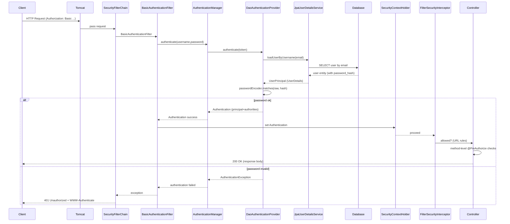

# Flux complet d'authentification HTTP Basic (SupplyChainX)

Ce document décrit en détail le traitement d'une requête protégée par HTTP Basic dans l'application SupplyChainX, du point d'entrée (client) jusqu'à l'exécution de la méthode sécurisée. Il montre les filtres de la Security Filter Chain, le chemin success / échec, et des schémas pour visualiser le flux. Le texte et les noms de classes se réfèrent à une application Spring Boot + Spring Security (versions récentes).

---

## Vue d'ensemble (résumé)
- Méthode d'authentification : HTTP Basic (Authorization: Basic <base64(email:password)>).
- Composants clés côté serveur :
    - SecurityFilterChain (ensemble de filtres Spring Security)
    - BasicAuthenticationFilter (gère l'en-tête Authorization Basic)
    - AuthenticationManager → DaoAuthenticationProvider
    - JpaUserDetailsService (charge l'utilisateur depuis la BD)
    - PasswordEncoder (BCryptPasswordEncoder)
    - SecurityContextHolder (contient l'Authentication si succès)
    - Méthode-level security : @EnableMethodSecurity + @PreAuthorize

- Comportement important :
    - Basic est "stateless" par nature : les identifiants sont renvoyés à chaque requête. (Vous pouvez combiner avec gestion de session, mais pour les APIs REST on recommande SessionCreationPolicy.STATELESS.)
    - En cas d'échec d'authentification, le serveur renvoie 401 et l'en-tête `WWW-Authenticate: Basic realm="..."`.

---

## Principales étapes fonctionnelles (texte)
1. Le client envoie une requête HTTP (par ex. POST /api/raw-materials) avec l'en-tête :
   Authorization: Basic base64(email:password)
2. Le conteneur servlet (Tomcat) transfère la requête à Spring MVC. Spring Security a préalablement placé sa SecurityFilterChain dans le filtre de servlets — les filtres sont exécutés dans l'ordre.
3. SecurityFilterChain applique successivement les filtres. Pour Basic les filtres importants sont notamment :
    - SecurityContextPersistenceFilter : restaure (ou initialise) le SecurityContext pour la requête.
    - CorsFilter (si configuré)
    - ExceptionTranslationFilter : intercepte AuthenticationException ou AccessDeniedException pour renvoyer 401/403.
    - BasicAuthenticationFilter : vérifie la présence de l'en-tête Authorization Basic et tente l'authentification.
    - AnonymousAuthenticationFilter (si aucune authentification établie)
    - FilterSecurityInterceptor (ou équivalent AuthorizationManager) : applique les règles d'autorisation d'URL.
4. Si BasicAuthenticationFilter trouve un header Authorization Basic :
    - Il décode le base64, obtient la paire (username, password) — dans votre projet le "username" est l'email.
    - Il construit un UsernamePasswordAuthenticationToken et le soumet à l'AuthenticationManager.
5. AuthenticationManager délègue au DaoAuthenticationProvider (fourni par Spring Security lorsque vous utilisez un UserDetailsService) :
    - DaoAuthenticationProvider appelle UserDetailsService.loadUserByUsername(email).
    - Votre JpaUserDetailsService récupère la `User` depuis la base (via UserRepository).
    - JpaUserDetailsService retourne un UserDetails (ici `UserPrincipal`).
6. DaoAuthenticationProvider utilise le PasswordEncoder (BCryptPasswordEncoder) pour comparer le mot de passe en clair fourni avec le `passwordHash` stocké :
    - passwordEncoder.matches(rawPassword, storedHash)
    - Si matches → Authentication réussie ; un Authentication (principal + authorities) est renvoyé et placé dans SecurityContextHolder.
    - Si échec → AuthenticationException levée.
7. Après authentification, le FilterSecurityInterceptor exécute la logique d'autorisation basée sur les règles URL et (plus tard) les annotations @PreAuthorize côté méthode :
    - Les règles URL sont évaluées (ex : .requestMatchers(...).hasRole(...)). Si la vérification URL échoue → AccessDeniedException (403).
8. La requête atteint le contrôleur / service :
    - Vous pouvez récupérer le principal typé (UserPrincipal) via `@AuthenticationPrincipal UserPrincipal principal` ou via SecurityContextHolder.
    - Si la méthode est annotée `@PreAuthorize(...)`, Spring Method Security vérifie les autorités (via MethodSecurityInterceptor) avant l'exécution.
9. Réponses :
    - Succès → code 200/201 + payload.
    - Échec authentification → 401 Unauthorized + en-tête `WWW-Authenticate: Basic realm="RealmName"`.
    - Échec autorisation → 403 Forbidden.

---

## Schéma séquentiel (Mermaid)
(Si votre viewer ne supporte pas Mermaid, utiliser le diagramme ASCII ensuite.)



---

## Alternative : diagramme ASCII (portable)
Client -> Servlet Container (Tomcat)
-> SecurityFilterChain:
-> SecurityContextPersistenceFilter
-> CorsFilter
-> ExceptionTranslationFilter
-> BasicAuthenticationFilter  <-- checks Authorization header
-> AuthenticationManager
-> DaoAuthenticationProvider
-> JpaUserDetailsService.loadUserByUsername(email)
-> UserRepository -> DB (password_hash)
<- UserDetails (UserPrincipal)
-> passwordEncoder.matches(raw, hash)
<- Authentication (success) -> SecurityContextHolder set
-> AnonymousAuthenticationFilter (if no auth)
-> FilterSecurityInterceptor (URL rules)
-> DispatcherServlet -> Controller -> Service
-> Method security interceptor (@PreAuthorize)
<- Response

---

## Points techniques et éléments utiles (référence code)
- SecurityConfig (extrait pertinent)
```java
@Bean
public SecurityFilterChain securityFilterChain(HttpSecurity http) throws Exception {
    http
        .httpBasic(Customizer.withDefaults())          // active HTTP Basic
        .csrf(csrf -> csrf.disable())                 // API stateless - adapter si besoin
        .authorizeHttpRequests(authorize -> authorize
            .requestMatchers("/v3/api-docs/**", "/swagger-ui/**").permitAll()
            .anyRequest().authenticated()
        );
    return http.build();
}

@Bean
public PasswordEncoder passwordEncoder() {
    return new BCryptPasswordEncoder();
}
```

- JpaUserDetailsService (extrait)
```java
@Override
public UserDetails loadUserByUsername(String username) throws UsernameNotFoundException {
    User user = userRepository.findByEmail(username)
            .orElseThrow(() -> new UsernameNotFoundException("User not found"));
    return new UserPrincipal(user); // UserPrincipal implements UserDetails
}
```

- UserPrincipal.getAuthorities() doit renvoyer `ROLE_<NAME>` afin que `hasRole("NAME")` fonctionne :
```java
@Override
public Collection<? extends GrantedAuthority> getAuthorities() {
    return List.of(new SimpleGrantedAuthority("ROLE_" + role.name()));
}
```

---

## Réponses HTTP spécifiques et en-têtes
- Succès (authentifié + autorisé) : 200 / 201 (avec JSON)
- Non authentifié : 401 Unauthorized
    - En-tête de challenge : `WWW-Authenticate: Basic realm="SupplyChainX"`
- Authentifié mais non autorisé : 403 Forbidden
- Note : Spring (ExceptionTranslationFilter) gère la conversion AuthenticationException -> 401 et AccessDeniedException -> 403.

---

## Bonnes pratiques et recommandations
- Stocker les mots de passe en BCrypt (déjà appliqué).
- Pour APIs publiques, préférer SessionCreationPolicy.STATELESS pour éviter conservation du contexte côté serveur :
  ```java
  http.sessionManagement(session -> session.sessionCreationPolicy(SessionCreationPolicy.STATELESS));
  ```
- Utiliser HTTPS en production (pour protéger les en-têtes Authorization).
- Passer à JWT/OAuth2 si vous avez besoin d'un modèle stateless plus riche (tokens, claims, expiration).
- Garder `UserPrincipal` simple : ne pas exposer l'entité JPA complète si vous la placez dans le principal (risque de LazyInitialization/serialization).
- Limiter l'exposition de Swagger en production (ne pas permitAll).

---

## Exemples de test rapide
- curl (Basic) :
```
curl -v -u "GESTIONNAIRE_APPROVISIONNEMENT@gmail.com:secret" \
  -X POST "http://localhost:8080/api/raw-materials" \
  -H "Content-Type: application/json" \
  -d '{"name":"steel","unit":"kg","pricePerUnit":12.5}'
```

- Postman :
    - Authorization → Type: Basic Auth → Username: email, Password: secret
    - Vérifier que l'en-tête Authorization est ajouté (preview request) puis envoyer.

---

## Flow de debug (si problème)
- Si logs affichent `Encoded password does not look like BCrypt` :
    - Vérifier que `password_hash` en DB est bien un hash BCrypt (commence par `$2a$` ou `$2b$`).
- Si 401 :
    - Vérifier header Authorization présent; vérifier email exact (cas-sensibilité du repository).
    - Vérifier l'instance de l'application que vous testez (Docker vs local).
- Si 403 :
    - Vérifier `role` de l'utilisateur et mapping `ROLE_<NAME>` dans UserPrincipal.
- Inspectez les logs d'authentification (DEBUG sur org.springframework.security.* pour plus de détails).

---

## Conclusion
Ce document décrit le traitement d'une requête Basic Auth dans Spring Security et identifie clairement où se produit chaque étape (décodage, validation, chargement utilisateur, comparaison de mot de passe, établissement du SecurityContext et contrôle d'accès). Utilisez les diagrammes fournis pour expliquer le flux aux développeurs et QA ; conservez la configuration (BCrypt + UserPrincipal + @PreAuthorize) et migrez vers JWT lorsque vous aurez besoin d'un modèle stateless plus évolué.
